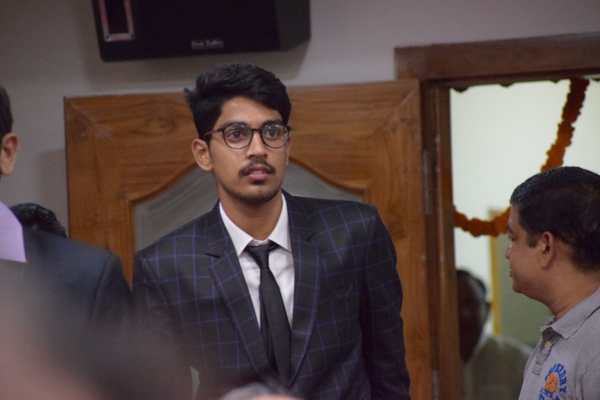

# Sai Sharma Mantha

I have worked in Capgemini for 2.5 years, where the project I was in was to take Operational and Development responsibilities of a E-Commerce web application.  

This experience has arised a interest of becoming a web developer, apart from this I have also represented my College
in Basketball tournaments. I like singing and recently i have started learning Carnatic Music but couldn't continue it for more than 2 months.

